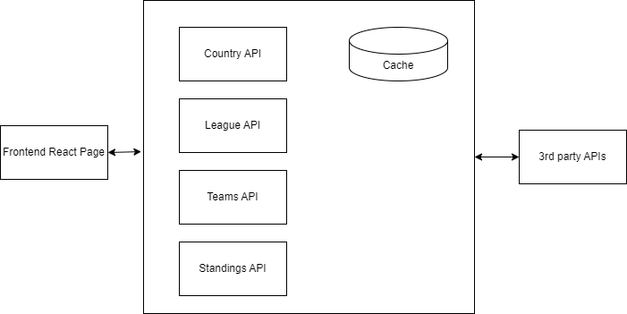

# Football Standings Microservice

This project is a microservice developed using React for the frontend and Spring Boot for the backend. It allows users to find standings of a football team playing in a league based on the country name, league name, and team name. The service fetches data from the [API Football](https://apifootball.com/documentation/#Standings) API and displays relevant results to the user.

## Description

The microservice provides the following functionalities:

- Users can view football standings by entering the country name, league name, and team name.
- The service is accessible via web browser or tools like Postman.
- It supports offline mode with toggles, ensuring that relevant results are still displayed even when the underlying dependencies (e.g., the API) are not available.

## API Data Sources

- API: [API Football](https://apifootball.com/documentation/#Standings)
- Key: 9bb66184e0c8145384fd2cc0f7b914ada57b4e8fd2e4d6d586adcc27c257a978

## Expected Output

The microservice displays the following information via an UI mechanism (React page):

- Country ID & Name: (<ID>) - <name>
- League ID & Name: (<ID>) - <name>
- Team ID & Name: (<ID>) - <name>
- Overall League Position: <position>

## Non-Functional Requirements (NFRs)

- Demonstrates SOLID, 12 Factor, and HATEOAS principles, Design Patterns in the design and implementation.
- Demonstrates Performance, Optimization & Security aspects.
- Demonstrates Production readiness of the code.
- Demonstrates TDD & BDD & Quality aspects.
- Sensitive information used in the Micro Services such as API keys are protected / encrypted.

## Build & Deploy

### Continuous Integration (CI)

- Build CI/CD pipeline for the project(s); Pipeline scripts are part of the codebase.
- Jenkins job config and scripts are part of the project sources.

### Continuous Deployment (CD)

- Service deployment is demonstrated using a Docker container.
- Docker files are part of the project sources.

## Architecture Diagram

## Steps to Start the Application

### Frontend (React)

1. Navigate to the `frontend` directory.
2. Install dependencies using `npm install`.
3. Start the development server using `npm start`.
4. Access the application at `http://localhost:3000`.

### Backend (Spring Boot)

1. Navigate to the `backend` directory.
2. Build the project using `./mvnw clean install`.
3. Run the Spring Boot application using `./mvnw spring-boot:run`.
4. The backend server will start at `http://localhost:8080`.

### Tests

- Automated tests can be run using the appropriate commands in the respective frontend and backend directories (`npm test` for React and `./mvnw test` for Spring Boot).

### Swagger Documentation

The Swagger documentation for the backend API can be accessed http://localhost:8080/swagger-ui/index.html

## Contributing

Contributions are welcome! If you'd like to contribute to this project, please fork the repository and create a pull request.

